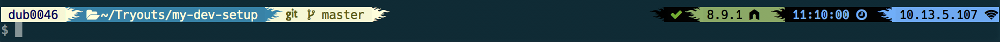
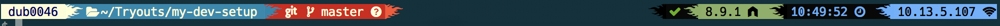
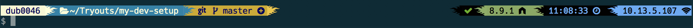
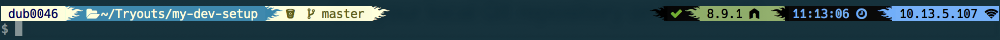
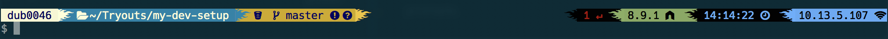

# Zsh Powerline using Powerlevel9k







Contents in Left Prompt:

* Hostname
* Working Directory
* Version Control System

Contents in Right Prompt:

* Status - Return code of the last command
* Root Indicator - An indicator if the user has superuser status
* Background Jobs - Indicator for background jobs
* Node Version - Version number of the installed Node.js
* AWS - The current AWS profile, if active
* Docker Machine - The current Docker Machine
* Time - System time
* IP - Current IP address

## Terminal Theme

I use theme [Solarized](http://ethanschoonover.com/solarized)

Terminal > Preferences > Profiles and select the "Solarized Dark" theme and click on “Default”

## Font

Font can be any *Monospaced Font*
I am using [Hack](https://sourcefoundry.org/hack/) patched with [Nerd Fonts](https://github.com/ryanoasis/nerd-fonts).
Download Nerd Font Pathed Hack(make sure you install the complete version) from https://github.com/ryanoasis/nerd-fonts/tree/master/patched-fonts/Hack/Regular/complete

Terminal > Preferences > Profiles > Text > Font > Change to *Hack Regular Nerd Font Complete 12pt*

## Setup Powerline

Powerline is a Python app and is a status line plugin for vim, and provides status lines and prompts.

### Install Python

Since Powerline is a Python app, it require *2.7.x* version of Python.

MacOS has Python pre-installed.
Check Python version by `python -V`

If the verision is not 2.7.x, install using homebrew `brew install python`

### Install pip

pip is a package manager for Python.

Download pip `curl https://bootstrap.pypa.io/get-pip.py -o get-pip.py`

Run the file `python get-pip.py`

Add python lib path to Path, in `~/.zshrc` add `export PATH="/usr/local/opt/python/libexec/bin:$PATH"`

### Install XCode Developer CLI tools

Powerline uses XCode Developer CLI tools to manipulate core OSX features.

`xcode-select —-install`

> This command opens up the installer and installs the XCode Developer CLI tools.

### Install Powerline

Install Powerline using pip.

`pip install --user powerline-status`

## Setup Zsh

Most versions of macOS ship with zsh by default.

To check if `zsh` is already installed run
`zsh --version`

This should return `zsh 5.1.1` or more recent.

To install zsh run
`brew install zsh zsh-completions`

To make zsh default shell run
`chsh -s $(which zsh)`

## Install Oh My Zsh

[Oh My Zsh](https://github.com/robbyrussell/oh-my-zsh) can be installed by running

`sh -c "$(curl -fsSL https://raw.githubusercontent.com/robbyrussell/oh-my-zsh/master/tools/install.sh)"`

## Install Powerlevel9k Theme

To install Powerlevel9k theme run

`$ git clone https://github.com/bhilburn/powerlevel9k.git ~/.oh-my-zsh/custom/themes/powerlevel9k`

and set `ZSH_THEME="powerlevel9k/powerlevel9k"` inside `~/.zshrc`

To customize and stylize Prompts refer https://github.com/bhilburn/powerlevel9k

## Set Zsh For Vscode Terminal (Optional)

Add the following lines to Workspace or User settings

```json
  "terminal.integrated.shell.osx": "zsh",
  "terminal.integrated.fontFamily": "hack nerd font"
```

## My Final .zshrc

```sh
# If you come from bash you might have to change your $PATH.
# export PATH=$HOME/bin:/usr/local/bin:$PATH

# Path to your oh-my-zsh installation.
export ZSH="/Users/rr235/.oh-my-zsh"

export TERM="xterm-256color"

# Set name of the theme to load. Optionally, if you set this to "random"
# it'll load a random theme each time that oh-my-zsh is loaded.
# See https://github.com/robbyrussell/oh-my-zsh/wiki/Themes
ZSH_THEME="powerlevel9k/powerlevel9k"
POWERLEVEL9K_MODE='nerdfont-complete'

# Fire Glyphs
POWERLEVEL9K_LEFT_SEGMENT_SEPARATOR=$'\uE0C0 '
POWERLEVEL9K_RIGHT_SEGMENT_SEPARATOR=$'\uE0C2 '

# New Lines
POWERLEVEL9K_PROMPT_ADD_NEWLINE=true
POWERLEVEL9K_PROMPT_ON_NEWLINE=true
POWERLEVEL9K_MULTILINE_FIRST_PROMPT_PREFIX=""
POWERLEVEL9K_MULTILINE_LAST_PROMPT_PREFIX="$ "

# Prompt Elemnts
POWERLEVEL9K_RIGHT_PROMPT_ELEMENTS=(status root_indicator background_jobs node_version aws docker_machine time ip)
POWERLEVEL9K_LEFT_PROMPT_ELEMENTS=(context dir vcs)
POWERLEVEL9K_CONTEXT_TEMPLATE="%m"

# NodeJs Version
POWERLEVEL9K_NODE_VERSION_BACKGROUND='107'
POWERLEVEL9K_NODE_VERSION_FOREGROUND='0'

# IP
POWERLEVEL9K_IP_BACKGROUND="75"
POWERLEVEL9K_IP_FOREGROUND="0"

# Time
POWERLEVEL9K_TIME_BACKGROUND="0"
POWERLEVEL9K_TIME_FOREGROUND="75"

# Last Command Status
POWERLEVEL9K_STATUS_OK_BACKGROUND='0'
POWERLEVEL9K_STATUS_OK_FOREGROUND='70'
POWERLEVEL9K_STATUS_ERROR_BACKGROUND='0'
POWERLEVEL9K_STATUS_ERROR_FOREGROUND='124'

# Machine Context
POWERLEVEL9K_CONTEXT_DEFAULT_BACKGROUND='230'
POWERLEVEL9K_CONTEXT_DEFAULT_FOREGROUND='17'

# Working Directory
POWERLEVEL9K_DIR_HOME_BACKGROUND='31'
POWERLEVEL9K_DIR_HOME_FOREGROUND='230'
POWERLEVEL9K_DIR_HOME_SUBFOLDER_BACKGROUND='31'
POWERLEVEL9K_DIR_HOME_SUBFOLDER_FOREGROUND='230'

# Version Control
POWERLEVEL9K_VCS_CLEAN_BACKGROUND='230'
POWERLEVEL9K_VCS_CLEAN_FOREGROUND='58'

POWERLEVEL9K_VCS_UNTRACKED_BACKGROUND='160'
POWERLEVEL9K_VCS_UNTRACKED_FOREGROUND='230'

POWERLEVEL9K_VCS_MODIFIED_BACKGROUND='178'
POWERLEVEL9K_VCS_MODIFIED_FOREGROUND='17'

plugins=(
  git
)

source $ZSH/oh-my-zsh.sh

```
